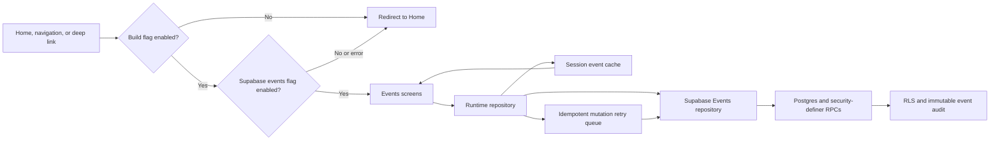

# Architecture

## Events Runtime

The public repository interface remains storage-agnostic. Screens depend only on the runtime repository. The seeded implementation is a test factory and is not reachable from production screens. Supabase remains authoritative; cached data is a read fallback and queued writes reconcile by replacing optimistic records with server records after a successful retry.
