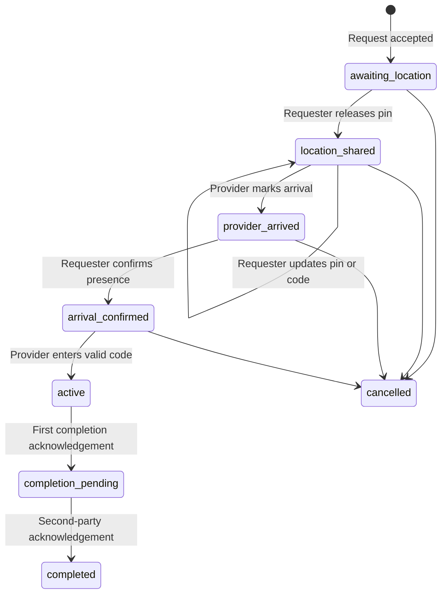

# Job Safety Session

Status: implementation and automated verification are included in the current integration checkpoint.

## Outcome

An accepted job uses one server-controlled safety session shared by the requester and assigned provider:

1. The requester releases or updates the exact service pin.
2. The assigned provider can read that pin only after release.
3. The provider marks arrival.
4. The requester confirms the expected person is physically present.
5. The provider enters a six-digit code shown only to the requester.
6. The server moves the job to `In progress` after a valid code.
7. The provider and requester independently acknowledge completion.
8. The server moves the job to `Completed` only after both acknowledgements.

## State machine

## Security invariants

- `job_safety_sessions` has RLS enabled and no direct `anon` or `authenticated` table grants.
- Exact coordinates and entrance details are returned only by an authorization-checking RPC.
- Only the requester can release or change the private service pin.
- Only the assigned provider can mark arrival or submit the code.
- Only the requester can confirm the provider's physical arrival.
- Exact coordinates and entrance details are AES-256 encrypted with a deployment-provided database key and fail closed when that key is unavailable.
- Location release records the approved consent-policy version and timestamp.
- The code is generated from cryptographic bytes, stored only as a bcrypt hash, expires after 15 minutes, and is retired after successful use.
- Five invalid attempts lock code entry until the requester issues a replacement code.
- Replacement codes invalidate the prior code and are audited.
- Direct provider changes to `In progress` and `Completed` are denied; those statuses are written by the safety RPCs.
- All sensitive reads and transitions create `audit_events` records without storing the code or coordinates in audit metadata.

## Mobile surfaces

- Requester: `/hire/request/status` links accepted and active jobs to `/hire/request/safety-session`.
- Provider: `/provider/request/[requestId]` links accepted and active jobs to the same role-aware session.
- The legacy provider status screen no longer writes `In progress` or `Completed` directly.

## Verification coverage

- Mobile repository mapping and RPC contract tests.
- UI source contract tests for both role entry points and removal of direct status writes.
- SQL security test covering requester release, unauthorized provider denial, provider arrival, requester confirmation, wrong-code rejection, valid-code activation, two-party completion, code-hash retirement, and audit evidence.

## Required device checks

- Compact phone and tablet layout.
- Text scaling and screen-reader labels for the six-digit code.
- Keyboard behavior for coordinates and code entry.
- Offline/retry behavior after each transition.
- Concurrent taps and repeated completion acknowledgements.
- Request cancellation or reporting at each pre-active state.
