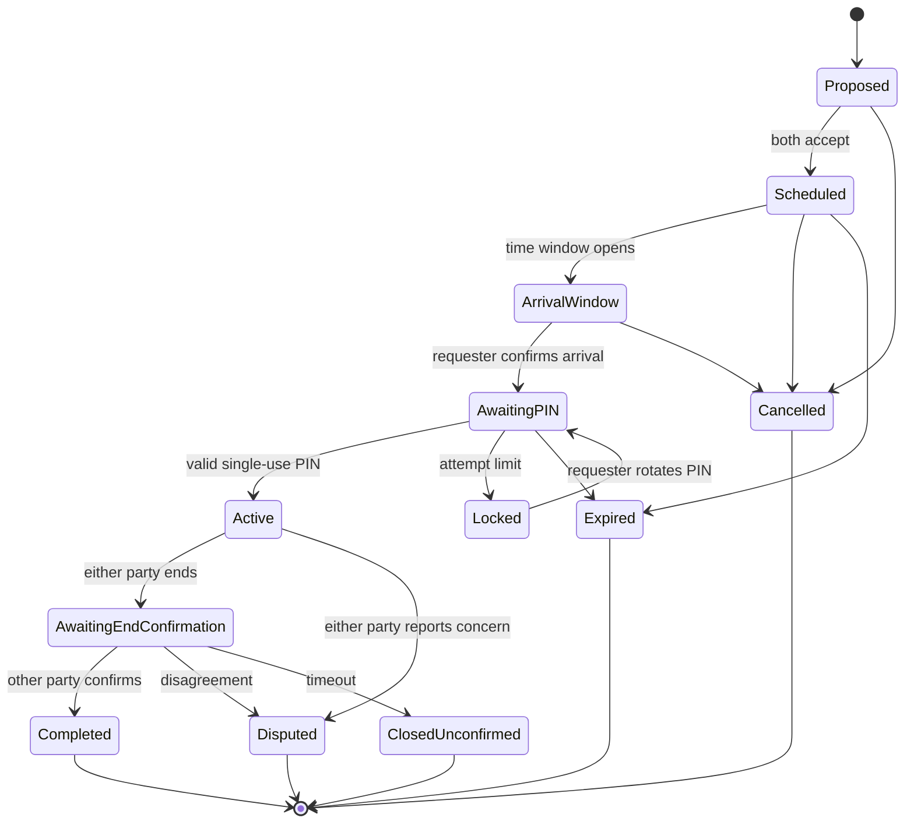

# Job Safety Session: Pre-Implementation Specification

Status: Draft for founder, privacy, legal, and trust-and-safety review  
Date: 2026-08-12  
Market assumption: Accra, Ghana pilot  
Code status: Not implemented and not approved for production activation

## 1. Decision

My Corner should use a bounded **Job Safety Session** after a requester and provider agree to a job. It may record an arrival handoff, a one-time PIN confirmation, active-session status, and the end of the visit.

The first release must **not** continuously track either person's location. "Live" means that both apps display the same server-authoritative session state and timestamps. Continuous GPS, background tracking, facial recognition, automated identity judgments, police sharing, and automatic liability findings remain separate later proposals requiring a new privacy impact assessment and founder approval.

The PIN confirms only that the requester intentionally started the scheduled visit with the signed-in provider account. It is not proof that the named person physically entered, blanket consent to all conduct, a waiver, a guarantee of safety, or an automatic finding of criminal or civil liability.

## 2. Goals and Non-Goals

Goals:

- Help the requester compare the arriving provider's name and approved profile photo.
- Reveal the precise service location only through a time-bounded, consent-based workflow.
- Give the requester a short-lived PIN to start the visit.
- Create a tamper-evident record of who initiated, confirmed, and ended the session, and when.
- Let either party end or dispute a session without being trapped by the other party.
- Give trained staff a least-privilege incident record for human review.

Non-goals:

- Guarantee provider or requester conduct.
- Replace emergency services, insurance, a contract, or law-enforcement evidence rules.
- Perform facial recognition, emotion recognition, or AI trust scoring.
- Continuously record GPS, audio, video, or ambient device data.
- Make criminal, fault, negligence, or liability determinations.
- Expose a home's exact address to browsers, search, analytics, push notifications, logs, or other users.

## 3. Roles

- **Requester:** books the work, controls address release, receives the PIN, confirms the arriving provider, and can start/end/dispute the visit.
- **Provider:** accepts the job, views the address during the approved window, enters the PIN in their own authenticated app, and can end/dispute the visit.
- **Moderator:** cannot browse precise addresses by default; sees redacted session facts only for an assigned case.
- **Safety administrator:** exceptional, audited access to precise data after step-up authentication and a documented case reason.
- **System:** enforces transitions, authorization, expiry, rate limits, audit creation, and deletion schedules.

## 4. User Flow

1. Both parties agree to the job scope and time.
2. The requester confirms the service pin on a map and an address label. Public surfaces continue to show only the general area.
3. The system creates a scheduled session and a cryptographically random, single-use six-digit PIN.
4. The requester sees the provider's approved display name, profile photo, service, and relevant verification evidence. No face matching is automated.
5. At the configured arrival window, the provider can view the precise destination. The release is logged.
6. Before entry or work begins, the requester compares the arriving person with the profile and gives the PIN voluntarily.
7. The provider enters the PIN. The server verifies it, records both account identities and timestamps, consumes the PIN, and moves the session to **Active**.
8. Both apps show a clearly labeled active state and safety actions.
9. Either party may end immediately. One-sided ending stops any active collection and creates **Ended by requester/provider; awaiting confirmation**.
10. A matching end confirmation closes the session. A disagreement opens a dispute workflow. A timeout closes the active state without pretending both parties agreed.

The app must tell users not to share the PIN remotely or before the provider is physically present and visually checked.

## 5. State Model

No client may set a state directly. Every transition must be a server-side function that checks the current state, caller, role, expiry, and idempotency key.

## 6. PIN Security

- Generate six digits with a cryptographically secure random generator.
- Store only a server-side keyed verifier, never the plaintext PIN.
- Bind the verifier to the session ID, requester, provider, and expiration.
- Expire after 15 minutes, after first successful use, when either party cancels, or when the requester rotates it.
- Allow five failed attempts per session, with account, device, and IP rate limits.
- After the limit, lock verification and require requester rotation or staff-assisted recovery.
- Never place the PIN in push notification text, SMS previews, analytics, logs, screenshots generated by support tooling, or URLs.
- Do not allow offline success. An offline device may collect the entry locally but must show **Not confirmed** until the server accepts it.
- Return generic failure messages that do not reveal which binding failed.

## 7. Location and Map Rules

- Browsing and matching use neighborhood or service-area data only.
- The requester chooses the service point and reviews the label before saving.
- Store My Corner's own coordinates and user-confirmed label only after explicit consent.
- Encrypt exact coordinates and address fields separately from general-area fields.
- Reveal exact location only to the assigned provider, during the approved window, on an authenticated device.
- Revoke provider access on cancellation, expiry, account restriction, or session closure.
- Never include exact location in client logs, crash breadcrumbs, analytics, emails, push payloads, exports, or moderation queues.
- An address-view event must record actor, session, purpose, and timestamp.
- Initial implementation uses no background GPS and no route history.
- If Google Geocoding is selected, preserve required Google Maps attribution and design storage around current caching restrictions. Place IDs may be retained as permitted, but Google content must not be treated as unrestricted permanent application data. A public Terms of Use and Privacy Policy are prerequisites.
- Google Maps billing and production activation require founder approval.

## 8. Identity Evidence

The arriving provider card may show:

- approved profile photo;
- legal or display name according to the approved identity policy;
- phone verification;
- identity-check status and date, if a production provider and legal process are approved;
- account age, completed jobs, ratings, and community recommendations.

The app must not claim a guaranteed identity or trust outcome. It must not use facial recognition. A mismatch action should advise the requester not to proceed, preserve personal safety, and report the concern. Raw identity documents and biometric templates must not be stored in the mobile app.

Requester disclosure to the provider should be minimized to the first name or chosen display name, job details, and service location during the allowed window. Requester identity photos are not required for the first release.

## 9. Consent and Safety Language

Separate consent is required for:

- saving the precise service location;
- releasing it to the assigned provider;
- starting the safety session;
- optional future continuous location collection;
- any identity-document or biometric processing.

Consent must be specific, revocable where operationally possible, and recorded with policy version and timestamp. Refusing optional tracking must not silently block the basic job request.

Required notices:

- The PIN records an agreed handoff; it does not guarantee conduct.
- My Corner is not an emergency service.
- In immediate danger, leave if possible and contact the appropriate local emergency service.
- Do not confront a person solely to collect evidence.
- Reports are reviewed by people and may be contested.

Legal and privacy wording requires founder approval and Ghana-qualified review before production.

## 10. Data Inventory and Privacy Analysis

| Data | Purpose | Sensitivity | Default access |
|---|---|---|---|
| Session parties and job ID | Bind the correct requester/provider/job | High | Parties; assigned safety staff |
| Exact coordinates/address | Provider arrival | Very high | Requester; assigned provider in window |
| PIN verifier and attempts | Confirm handoff; prevent guessing | Very high | Server only |
| State transitions and timestamps | Shared status; disputes | High | Parties; assigned safety staff |
| Address-view audit | Detect misuse | High | Safety administrators |
| Profile photo and identity status | Manual arrival comparison | High | Parties during active workflow |
| Device/IP security signals | Abuse detection | High | Restricted security staff |
| Report text/attachments | Human safety review | Very high | Reporter and assigned reviewers |

Processing must follow purpose limitation, data minimization, accuracy, storage limitation, security safeguards, transparency, and data-subject rights. Ghana's Data Protection Act, 2012 (Act 843) is the legal baseline, but this document is not legal advice. A documented privacy impact assessment, controller/processor inventory, cross-border transfer review, breach procedure, access/correction/deletion process, and Data Protection Commission compliance review are production gates.

Mobile controls should be tested against OWASP MASVS storage, authentication, network, platform, and privacy categories. Sensitive data must not be written to public storage or exposed through screenshots, notifications, deep links, clipboard, backups, or inter-app communication.

## 11. Provisional Retention Policy

These periods are design defaults pending legal, insurance, dispute, and Data Protection Commission review.

| Record | Provisional retention | End action |
|---|---:|---|
| Plaintext PIN | Never stored | Memory only; discard immediately |
| PIN verifier | Until session ends, expires, or is cancelled, plus 24 hours | Irreversible deletion |
| Failed PIN-attempt events | 90 days | Delete or aggregate |
| Exact address and coordinates | Active job through 90 days after closure | Delete exact values; retain general area |
| Address-view audit | 24 months | Delete unless legal hold |
| Session transition ledger | 24 months after closure | Delete or irreversibly de-identify |
| Identity-check result/reference | Account life plus 90 days | Delete; vendor contract must cover upstream deletion |
| Raw ID/selfie evidence | Not stored by My Corner by default | Production vendor retention separately approved |
| Safety case and attachments | 24 months after case closure | Delete unless legal hold |
| Device/IP security logs | 90 days | Delete or aggregate |
| Encrypted backups | Maximum 35-day rolling window | Expire automatically |

Rules:

- Legal holds must be case-specific, approved, time-limited, and audited.
- Deletion propagates to search indexes, caches, replicas, exports, and processor deletion queues.
- Backup expiry is documented to the requester; backups are not restored into ordinary access after deletion.
- Retention jobs produce metrics without copying sensitive payloads.
- Users can request access, correction, or deletion; exceptions require a documented lawful basis and human response.

## 12. Abuse Cases and Controls

| Abuse case | Primary controls |
|---|---|
| Provider obtains PIN before arrival | In-app warning, short expiry, requester rotation, single use |
| PIN brute force | Five attempts, multi-key rate limits, lock and alerts |
| Stolen provider account | Secure session storage, reauthentication before address reveal, device/session revocation |
| Screenshot or shoulder surfing | Mask PIN, brief reveal, platform screen protection on sensitive screens where supported |
| Requester lures or harms provider | Provider check-in, bounded address reveal, exit/end action, report path |
| Provider refuses to end | Either party can stop immediately; dual confirmation is not required to stop collection |
| Requester falsely denies entry | Server transition ledger, consumed PIN event, human dispute review; no automatic guilt finding |
| Provider falsely claims entry | Server-only PIN verification bound to both accounts and session |
| GPS spoofing | No initial GPS proof claim; future signals treated as risk indicators only |
| Moderator curiosity or stalking | Assignment-based access, redaction, step-up authentication, immutable access audit |
| Domestic-abuse or coercive use | Discreet exit, notification redaction, no shared household dashboard, trained escalation |
| Exact address leaked in logs/push | Schema separation, payload allowlists, log scrubbing, automated tests |
| Offline replay | Server nonce, expiry, idempotency key, no offline confirmation |
| Collusion between parties | Audit supports review but never claims independent proof |
| Backend compromise | Encryption, least privilege, key rotation, monitoring, incident response |
| Map-provider data misuse | Contract review, approved caching model, attribution, restricted API keys |

## 13. Threat Model

Trust boundaries:

1. Requester device to My Corner backend.
2. Provider device to My Corner backend.
3. Backend to Supabase/Postgres and key management.
4. Backend or client to map/geocoding provider.
5. Safety staff console to restricted session data.
6. Notification, analytics, crash, and support processors.

| Threat | Example | Required mitigation |
|---|---|---|
| Spoofing | Attacker uses a stolen session or copied PIN | Strong auth, session revocation, step-up address access, bound PIN |
| Tampering | Client changes session state or timestamps | Server transitions, row-level security, append-only audit, idempotency |
| Repudiation | Party denies starting or ending | Signed-in actor IDs, server timestamps, audit integrity; human review |
| Information disclosure | Home address appears in logs or notifications | Separate encrypted fields, redaction, payload allowlists, access audit |
| Denial of service | PIN attempts lock a legitimate visit | Layered rate limits, safe rotation, recovery workflow |
| Elevation of privilege | Moderator browses all home addresses | Assignment scoping, step-up auth, just-in-time access, alerts |
| Linkability | Session history maps a person's routine | Minimize events, short exact-location retention, no ad/AI reuse |
| Coercion | User is forced to start or keep session active | Discreet exit, unilateral end, trained response, no punitive automation |

Security assumptions to validate:

- Supabase RLS is deny-by-default on every session table.
- Service-role credentials and PIN secret keys are backend-only.
- Mobile storage uses platform-protected storage only for session tokens, not PINs or exact-address caches.
- TLS certificate validation is intact; no sensitive data crosses unapproved third-party SDKs.
- Admin access supports MFA, step-up authorization, reason codes, alerts, and periodic review.
- Audit records are append-only for application roles and monitored for gaps.

## 14. Proposed Server Data Model

- `job_safety_sessions`: job, parties, state, approved window, policy version, created/closed timestamps.
- `job_safety_locations`: encrypted exact coordinates/address, general area, consent record, reveal window.
- `job_safety_pin_challenges`: keyed verifier, expiry, attempts, locked/consumed timestamps.
- `job_safety_session_events`: append-only transitions with actor, idempotency key, server time, reason.
- `job_safety_location_access_events`: actor, purpose, case, timestamp.
- `job_safety_disputes`: reporter, category, redacted narrative, status, assigned reviewer.
- `job_safety_legal_holds`: scoped record set, approver, reason, expiry.
- `job_safety_deletion_jobs`: due date, processor status, completion evidence.

Exact location must not live in the ordinary job-request row or general analytics tables.

## 15. API and Authorization Rules

All writes use authenticated server functions. Minimum operations:

- `schedule_job_safety_session(job_id, window, consent_version)`
- `set_job_safety_location(session_id, encrypted_location, general_area)`
- `reveal_job_safety_location(session_id, purpose)`
- `rotate_job_safety_pin(session_id)`
- `verify_job_safety_pin(session_id, pin, idempotency_key)`
- `end_job_safety_session(session_id, reason, idempotency_key)`
- `confirm_job_safety_end(session_id, idempotency_key)`
- `dispute_job_safety_session(session_id, category, narrative)`

Authorization must verify the authenticated profile is the session requester/provider or an explicitly assigned, step-up-authenticated reviewer. RLS must not rely on caller-supplied profile IDs.

## 16. Failure and Recovery Behavior

- Offline before PIN: show that confirmation requires a connection; do not claim Active.
- Timeout after submission: retry with the same idempotency key and fetch authoritative state.
- App force-close: restore the server state after authentication.
- Wrong device time: server time controls windows and expiry.
- Address provider failure: retain the requester's reviewed My Corner location only if policy permits; show the failure and do not silently substitute.
- One party loses access: allow support recovery without exposing the PIN or address to support staff.
- Account restriction during a visit: preserve safe exit/end controls and route to human review.
- Emergency report: prioritize immediate safety guidance; evidence collection is secondary.

## 17. Accessibility and Content Requirements

- All actions use 48 by 48 dp minimum targets and visible labels.
- PIN entry supports screen readers without reading the PIN aloud by default.
- Status uses text and iconography, not color alone.
- Large text must not hide the provider photo/name, active status, end button, or emergency guidance.
- No critical action is gesture-only.
- Reduced-motion and data-saver settings apply.
- Safety warnings use plain, calm English and localization-ready strings.

## 18. Verification Plan

Before code activation:

1. Complete a Ghana privacy impact assessment and qualified legal review.
2. Approve the exact retention schedule and user notices.
3. Threat-model the final architecture with engineering, trust and safety, and operations.
4. Test RLS for cross-user, cross-job, moderator, service-role, and deleted-account access.
5. Test PIN entropy, expiry, replay, brute force, rotation, offline handling, and idempotency.
6. Test address leakage through logs, analytics, notifications, crash reports, screenshots, exports, and backups.
7. Test requester and provider force-close/recovery across every state.
8. Run compact phone, tablet, large-text, screen-reader, poor-network, and clock-skew tests.
9. Conduct abuse-case tabletop exercises with Ghana-based safety reviewers.
10. Pilot with fictional locations and accounts before any real home visit.
11. Complete incident response, law-enforcement request, breach, deletion, and legal-hold runbooks.
12. Obtain founder approval before activating identity verification or production location processing.

## 19. Release Gates

No implementation may enter production until all are true:

- Product, engineering, trust-and-safety, privacy, and legal owners are named.
- Data Protection Commission and Ghana legal obligations are reviewed.
- Public privacy and terms language is approved.
- Map-provider contract, billing, key restrictions, attribution, and caching are approved.
- Identity provider and retention terms are approved.
- RLS, encryption, key rotation, audit, deletion, and access-review tests pass.
- A staffed incident and appeal process exists.
- Emergency limitations are visible and tested.
- Metrics exclude exact location, PIN, identity evidence, and report narratives.
- Founder explicitly approves production activation.

## 20. Open Founder Decisions

These decisions can wait until after legal/privacy review:

- Whether the pilot uses a map provider at all or begins with GhanaPost GPS plus manual pin confirmation.
- Whether requester identity evidence is ever shown to providers.
- The exact address reveal window.
- Whether a future opt-in GPS check-in is valuable enough to justify additional collection.
- Insurance, law-enforcement response, and evidence-preservation partnerships.
- The final retention periods after dispute and legal requirements are known.

## 21. Sources Checked

Checked 2026-08-12:

- [Ghana Data Protection Act, 2012 (Act 843), Data Protection Commission copy](https://dataprotection.org.gh/wp-content/uploads/2025/05/Data-Protection-Act-2012-Act-843.pdf)
- [OWASP Mobile Application Security Verification Standard](https://mas.owasp.org/MASVS/)
- [OWASP MASVS privacy controls](https://mas.owasp.org/MASVS/12-MASVS-PRIVACY/)
- [Google Geocoding API policies and attribution](https://developers.google.com/maps/documentation/geocoding/policies)
- [Google Geocoding API overview](https://developers.google.com/maps/documentation/geocoding/overview)

Provider terms, Ghana regulatory guidance, emergency information, and legal requirements must be rechecked immediately before implementation and production approval.
