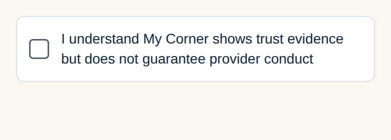
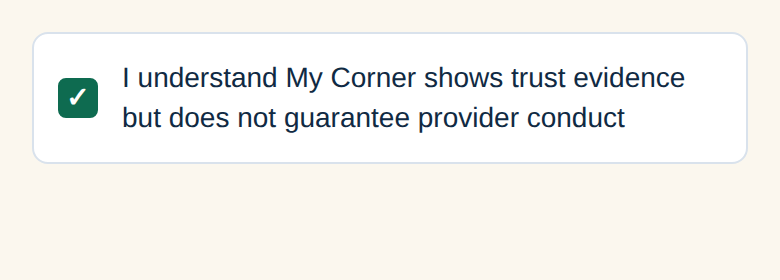

# Create Request trust acknowledgement correction

Base: main `4ad0f8fb51bd1ab53818bb845989f6d6d28db759`.
Branch: `codex/request-trust-checkbox`, separate from the avatar/Marketplace PR #173.

## Behavior

Create Request now has one white, subtly bordered acknowledgement row: a 20px checkbox, 12px internal padding and gap, existing My Corner text/color/radius tokens, and a minimum 48px row touch target. The entire row toggles the checkbox. Its accessible role is checkbox, its checked/disabled states are exposed, and its label contains the full requested statement:

> I understand My Corner shows trust evidence but does not guarantee provider conduct

The separate **Review and Accept** button, its native Alert confirmation, and the duplicate accepted labels are removed. The normal **Review request** screen/action is retained.

Acknowledgement starts unchecked, persists through Create → Review → Back in the same flow, and can be unchecked again. It clears on account/provider/flow changes. Old acceptance callbacks cannot reaccept after an A → B → A route change. Unchecking revokes acceptance synchronously, before a React rerender. Neither route parameters nor saved navigation state supply acceptance.

Both continuation and submission have UI disabled states and functional guards. Review checks current acceptance before starting submission (including attachment retries) and immediately before request creation after asynchronous work. A previously created request keeps its retry-safe identity; rechecking after a failed attachment lets that same request finish without duplicate creation. This remains a client request-flow requirement, not a new backend consent ledger.

## Verification

- Full mobile suite: **587 tests / 103 suites passed**.
- Focused Hire/media/validation suites: **22 tests passed**.
- Typecheck and formatting: passed.
- Lint: zero errors; 15 existing warnings outside the changed files.
- Android Expo/Hermes export: passed.
- [GitHub Mobile CI run 37869071732](https://github.com/pushee-io/My-Corner-Trusted-People/actions/runs/37869071732): all checks passed on application commit `79a4070c85d96381d5ae7e10b6e50387c12ac5d2`, including formatting, lint, typecheck, 587 tests, screenshot capture and web export. The following evidence-only commit changes documentation and PNGs.
- Eight acknowledgement integration cases in `hire-media-flow.test.ts` cover visible text/checkbox, unchecked default, no confirmation Alert, disabled-handler invocation, checked continuation, normal Review/Back/submit, unchecking, injected route flags, provider/account resets, old callbacks, synchronous stale-submit rejection, async upload revocation and attachment retry. Existing media/AI request-flow tests remain passing.
- `media-product-screens.test.ts` uses the reversible acceptance API and retains normal submission/attachment retry coverage.

## Visual evidence

`mobile/scripts/capture-trust-acknowledgement.cjs` renders the actual component and tokens through React Native Web, with no copied CSS or replacement design. CI captures checked and unchecked PNGs and uploads the HTML/PNG artifact `trust-acknowledgement-component-states`. These are component screenshots, **not emulator evidence or a full native Create Request screenshot**.

Inspected both screenshots: the entire statement is readable, the thin border and checkbox are visible, and the checked state uses the existing green primary color with a white tick.

Native Android layout, TalkBack and emulator/phone acceptance are still pending because this environment has no Android emulator/connected device. The user's current PR #173 test app does not include this independent correction. No merge, APK build, backend migration/deployment or Production change is performed here.

## Files

- `mobile/app/hire/request/new.tsx`
- `mobile/app/hire/request/review.tsx`
- `mobile/src/components/TrustAcknowledgement.tsx`
- `mobile/src/components/media/RequestMediaProvider.tsx`
- `mobile/src/lib/request-validation.ts`
- `mobile/src/__tests__/hire-media-flow.test.ts`
- `mobile/src/__tests__/media-product-screens.test.ts`
- `mobile/scripts/capture-trust-acknowledgement.cjs`
- `.github/workflows/mobile-ci.yml`
- `docs/REQUEST_TRUST_CHECKBOX_CHECKPOINT.md`
- `docs/evidence/request-trust-checkbox/acknowledgement-unchecked.png`
- `docs/evidence/request-trust-checkbox/acknowledgement-checked.png`
